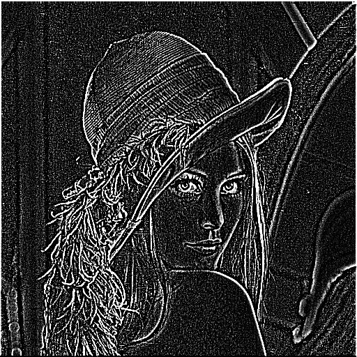

# Image filtering (lowpass/highpass filtering) using NVIDIA NPP with CUDA
| lowpass result |highpass result | Original image |
|-|-|-|
|  |  | |
|||
## Description

This project demonstrates the use of NVIDIA Performance Primitives (NPP) library with CUDA to perform image filtering. More specifically, the goal is to utilize GPU acceleration to efficiently filter a given image through a lowpass filter (for example, Gaussian filter) and a high pass filter, leveraging the computational power of modern GPUs. While the lowpass filter (e.g., Gaussian filter) smooths the image by removing the high-frequency details, the highpass filter will keep those details. Comparing the lowpass/highpass filtered results of a series of example images (i.e., `Lena`, `tree`, `couple`, `girl`, `woman`), I have learned the drastic differences in effects of the two filters. 

The project is a part of the CUDA at Scale for the Enterprise course and serves as a example for understanding how to implement basic image processing operations using CUDA and NPP.

## Key Concepts

Performance Strategies, Image Processing, NPP Library

## Code Organization

```bin/```
This folder hold all binary/executable code that is built automatically.

```data/```
This folder should hold all example images in `*.pgm` format(original and lowpass/highpass filtered).

```lib/```
This folder includes extra library dependency.

```src/```
This folder includes source code.

```README.md```
This file should hold the description of the project so that anyone cloning or deciding if they want to clone this repository can understand its purpose to help with their decision.

```Makefile or CMAkeLists.txt or build.sh```
There should be some rudimentary scripts for building your project's code in an automatic fashion.

```run.sh```
An optional script used to run your executable code, either with or without command-line arguments.

## Supported SM Architectures

[SM 3.5 ](https://developer.nvidia.com/cuda-gpus)  [SM 3.7 ](https://developer.nvidia.com/cuda-gpus)  [SM 5.0 ](https://developer.nvidia.com/cuda-gpus)  [SM 5.2 ](https://developer.nvidia.com/cuda-gpus)  [SM 6.0 ](https://developer.nvidia.com/cuda-gpus)  [SM 6.1 ](https://developer.nvidia.com/cuda-gpus)  [SM 7.0 ](https://developer.nvidia.com/cuda-gpus)  [SM 7.2 ](https://developer.nvidia.com/cuda-gpus)  [SM 7.5 ](https://developer.nvidia.com/cuda-gpus)  [SM 8.0 ](https://developer.nvidia.com/cuda-gpus)  [SM 8.6 ](https://developer.nvidia.com/cuda-gpus)

## Supported OSes

Linux, Windows

## Supported CPU Architecture

x86_64, ppc64le, armv7l

## CUDA APIs involved

## Dependencies needed to build/run
[FreeImage](../../README.md#freeimage), [NPP](../../README.md#npp)

## Prerequisites

Download and install the [CUDA Toolkit 11.4](https://developer.nvidia.com/cuda-downloads) for your corresponding platform.
Make sure the dependencies mentioned in [Dependencies]() section above are installed.

## Running the Program
You can run the program using the following command:

```bash
make run
```

This command will execute the compiled binary, applying the lowpass/highpass filter on the example input image (Lena.pgm), and save the result as Lena_gaussianFilter.pgm/Lena_highpassFilter.pgm in the data/ directory.

If you wish to run the binary directly with custom input/output files, you can use:

```bash
./bin/x86_64/linux/release/gaussianFilterNPP.exe --input data/Lena.pgm
./bin/x86_64/linux/release/highpassFilterNPP.exe --input data/Lena.pgm
```


